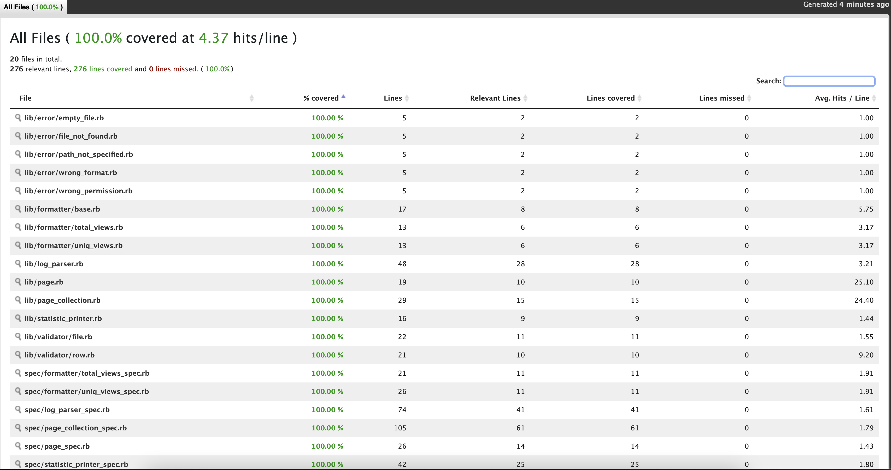

# LogParser


This repository is written as an example.

## Task

Write a ruby script that:

a. Receives a log as argument (webserver.log is provided) e.g.: `./parser.rb webserver.log`

b. Returns the following:
- list of webpages with most page views ordered from most pages views to less page views e.g.:
```
/home 90 visits
/index 80 visits
etc...
```
- list of webpages with most unique page views also ordered e.g.:
```
/about/2 8 unique views
/index 5 unique views
etc...
```

## instalation

```
$ bundle install --path vendor/bundle
```

## Run instruction

```
$ ./parser.rb webserver.log
```

## Correct format of the log file

```
url ip
next_url ip
```

## Run tests

```
$ bundle exec rspec spec
```

## Test coverage

```
$ bundle exec rspec & open coverage/index.html 
```

Example:



## Future improvements

- adding new types of reports(by use custom sort)
- more validators(url format or something else)
- move file logic from log_parser to separate module
- more control over which report we want to display
- dsl for compact sort types
